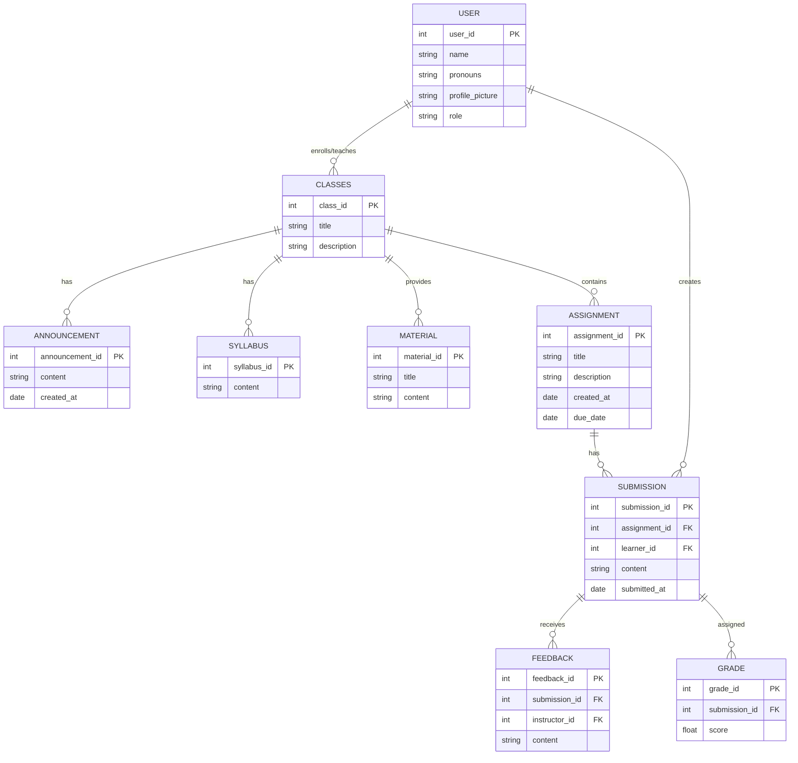

Initial ER Diagram made with ChatGPT, some changes were made by me

Things to note
- Some relationships may change in the futre
- Haven't looked too much into the database we are using, so a variable length string would likely be better than strings, if available

