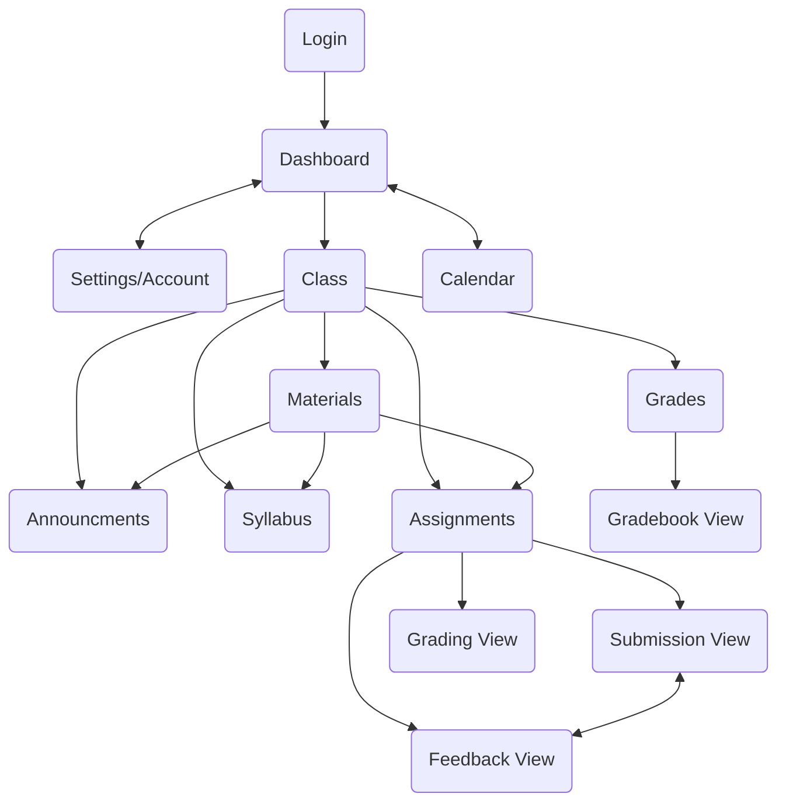

# Sitemap

Should appear as a graph on GitHub

```mermaid
    graph TD;
        A(Login)-->B(Dashboard);
        B<-->C(Settings/Account);
        B-->D(Class);
        B<-->E(Calendar);
        D-->F(Announcments);
        D-->G(Syllabus);
        D-->H(Materials);
        D-->I(Assignments);
        D-->J(Grades);
        J-->O(Gradebook View)
        I-->K(Submission View);
        I-->L(Feedback View);
        I-->M(Grading View);
        K<-->L;
        H-->G;
        H-->F;
        H-->I;
```